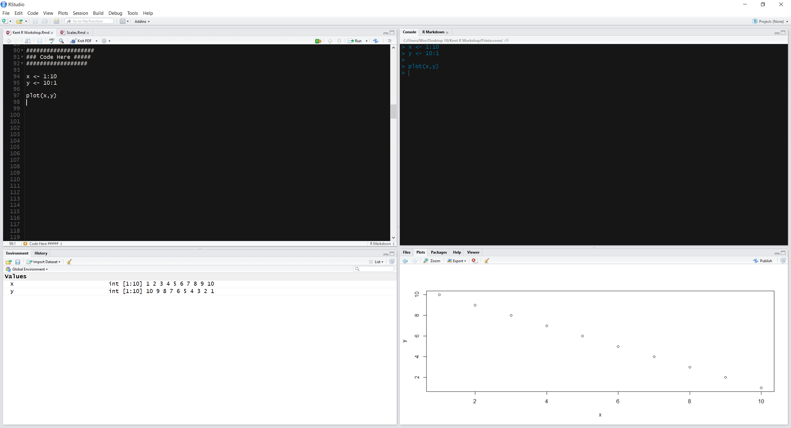

```{r knitr_init, echo=FALSE, cache=FALSE, warning=FALSE}
library(knitr)
library(rmdformats)

## Global options
options(max.print="75")
opts_chunk$set(echo=FALSE,
	             cache=TRUE,
               prompt=FALSE,
               tidy=TRUE,
               comment=NA,
               message=FALSE,
               warning=FALSE)
opts_knit$set(width=75)
```

# Introduction to R & Statistics

## First steps in programing in R

This is the first installment of an "Introduction to R & Statistics" course. Here, we will learn take the first steps in programing in R, as well as run statistical analyses.


2. Advantages of R

There are many reasons why R is the language of Data Science and Statistics. 

1. It is Free and Open-source.
2. It runs on UNIX, Windows and Macintosh.
3. It is especially written for vector operations. [no need of _for loops_]
4. It has one of biggest online communities, where you can ask questions, get help, etc.
5. It offers 7000+ packages, which expands it capabilities - through allowing people to create content - giving R endless possibilities.
6. It is a Programming language based on S, which allows for very fast operations, which is why it is considered to be the _language of data science_.
7. There are several user-interfaces which you can use (e.g., R-Studio, Jupyter)

## 2.1 Advantages of R & RStudio

1. [High-end Graphics](http://www.r-graph-gallery.com/)
2. [User-friendly interface](https://www.rstudio.com/rviews/2016/11/11/easy-tricks-you-mightve-missed/)
3. [Reports/Slides](http://rmarkdown.rstudio.com/gallery.html)
4. [Shiny apps](https://www.rstudio.com/products/shiny/shiny-user-showcase/)
5. [Abundant on-line Resources](https://www.rstudio.com/some-resources/)
6. [Abundant on-line Webnars](https://www.rstudio.com/resources/webinars/)


## 2.2 R & RStudio vs. other statistical softwares

If you are interested in knowing how much better R (and RStudio) is in compairson to other softwares, **[here a good source](https://en.wikipedia.org/wiki/Comparison_of_statistical_packages)**. I summarized the information contained in the link in the below table.

 

\pagebreak

# 3. Getting Started with R & RStudio

## Step 1. Downloading R

This is the website where you can actually download R, and many of the library packages that are available. 
Link: http://www.r-project.org/

### Step 1.1 Updating R

If you have R installed, you want update your R to the latest version. You can do so by running the below code. It will check for newer versions, and if one is available, it will guide you through the decisions you will need to make.

```{r, eval=FALSE}
install.packages("installr") # Install R package that facilitates the process
library(installr) # load the package in R
updateR() # update R
```

## Step 2. Downloading RStudio

RStudio is a great interface that makes R a lot more accessible. RStudio includes a console, syntax-highlighting editor that supports direct code execution, as well as tools for plotting, history, debugging and workspace management. 

Link: http://www.rstudio.com/products/rstudio/download/


### Step 2.1 Updating RStudio

If you have RStudio installed, you also want its latest version. Go to Help > Check updates in the menu. 

## Need help?

[Here's a video depicting the installation of R and RStudio (link)](https://www.youtube.com/watch?v=HuyaX7QQRlo). 

\pagebreak

# 4. RStudio Settings: _recommendations_

Before we start the workshop, lets through a number of settings which are worthwhile to know about. 

The advantages of these setting will bring us: 

* Code completion
* Inline documentation
* Live preview of Rmarkdown documents

Click on Tools menu, find _Global options_ (last option).

## Sub-menu: General options

* deselect the Restore .RData into workspace at startup,
* set Save workspace to .RData on exit to Never.

These options ensure that any content of previous R sessions is never stored or reloaded between R sessions.

## Sub-menu: Appearance

* Set the _Editor Theme_ to some less aggressive to the eyes. I use Chaos, but Cobalt, Idle Fingers, Mervivore Soft, Monokai, Solarized Light and Dark, and Tomorrow Night are also good options.   
* Set the zoom according to your screen settings. You can also use Font Size to achieve the same result.

## Sub-menu: Pane Layout

In the Pane layout section of the settings you can switch around the locations of certain user interface elements between the 4 different available panels. Play around a bit with the location and find a setting that works for you, but here's how I think is more intuitive for beginners.

* You want to make only one change: click on the bottom-left "Console" and choose "Environment, History, Build..." option. This should flip these two panels yielding an optimal setting in which you would have all that is "input" on the left, and what is output on the right.

```{r, out.height="210px", fig.align='center', echo=FALSE}

```


