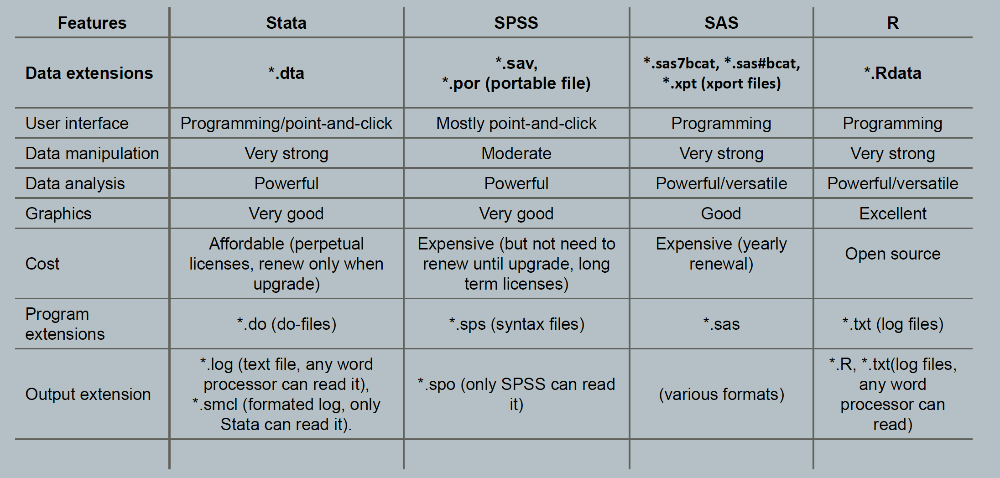
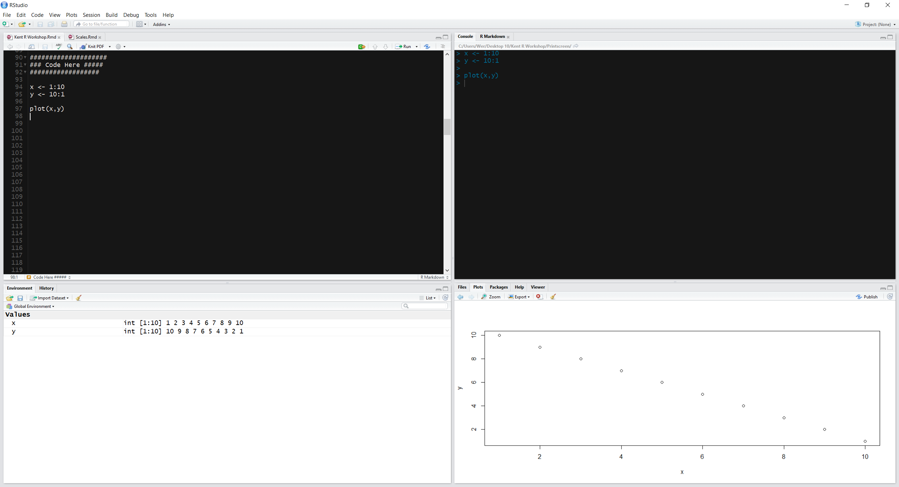

```{r knitr_init, echo=FALSE, cache=FALSE, warning=FALSE}
library(knitr)
library(rmdformats)

## Global options
options(max.print="75")
opts_chunk$set(echo=FALSE,
	             cache=TRUE,
               prompt=FALSE,
               tidy=TRUE,
               comment=NA,
               message=FALSE,
               warning=FALSE)
opts_knit$set(width=75)
```

This is the first installment of "*Introduction to R & Statistics*" . We will learn the first steps in programming in R, as well as run essential statistical analyses.

## 1. A bit of R history 

R is a programming language, a *statistical* programming language, designed by Ross Ihaka and Robert Gentleman as an implementation of the S programming language. 

Originally, the underlying goal of the researchers of the University of Auckland, New Zealand, was to develop a language that was capable to do data analysis, statistics and graphical models in user-friendly way. The project was first conceived in 1992, with its first version released in 1995 and a stable *beta* version in 2000. Noways, R is the *lingua franca of statistics*, and it is currently developed by the R Development Core Team, of which Chambers is a member.

Curiously, R is named partly after the first names of the first two R authors and partly as a play on the name of S.[ref](https://cran.r-project.org/doc/FAQ/R-FAQ.html#Why-is-R-named-R_003f)

## 2. Advantages of R

There are many reasons why R is the language of Data Science and Statistics. 

1. It is Free and Open-source.
2. It runs on UNIX, Windows and Macintosh.
3. It is especially written for vector operations. [no need of _for loops_]
4. It has one of biggest online communities, where you can ask questions, get help, etc.
5. It offers 7000+ packages, which expands it capabilities - through allowing people to create content - giving R endless possibilities.
6. It is a Programming language based on S, which allows for very fast operations, which is why it is considered to be the _language of data science_.
7. There are several user-interfaces which you can use (e.g., R-Studio, Jupyter)

## 3. Advantages of R with RStudio

While R has a command line interface, there are several graphical front-ends available. In this course we will explore RStudio which has many (many!) features that will be useful in learning R. Here's what the partnership between R & Rstudio can do.

1. [High-end Graphics](http://www.r-graph-gallery.com/)
2. [User-friendly interface](https://www.rstudio.com/rviews/2016/11/11/easy-tricks-you-mightve-missed/)
3. [Reports/Slides](http://rmarkdown.rstudio.com/gallery.html)
4. [Shiny apps](https://www.rstudio.com/products/shiny/shiny-user-showcase/)
5. [Abundant on-line Resources](https://www.rstudio.com/some-resources/)
6. [Abundant on-line Webnars](https://www.rstudio.com/resources/webinars/)


## 4. R with RStudio vs. other statistical softwares

If you are interested in knowing how R (and RStudio) compare to other software, [here a good source](https://en.wikipedia.org/wiki/Comparison_of_statistical_packages). The information contained in the link is summarized in the below table.

```{r Compairson between most common Statistical Software, out.height="210px", fig.align='center', echo=FALSE}

```

### 4.1 R with RStudio vs. Python

On the off chance that you are wondering whether to learn R or Python, most Statisticians and Data scientists agree that you probably should start with R, and as you go along, Python can be really useful. For example, in case of Deep learning, scripting, and big data-sets (> millions cases). One of the best resources discussing this issue freely available is on [datacamp.com.](https://www.datacamp.com/community/tutorials/r-or-python-for-data-analysis#gs.VEYBJyM)


## 5. Getting Started with R & RStudio: 

### 5.1 Downloading and Installing R

This is the website where you can download R, and many of the library packages that are available. 

[Link](http://www.r-project.org/)

### 5.2 Updating R

If you have R already installed, you want update your R to the latest version. You can do so by running the below code. It will check for newer versions, and if one is available, it will guide you through the decisions you will need to make.

```{r, eval=FALSE, echo=TRUE}
install.packages("installr") # Install R package that facilitates the process
library(installr) # load the package in R
updateR() # update R
```

### 5.3 Downloading RStudio

RStudio is a great interface that makes R a lot more accessible. RStudio includes a console, syntax-highlighting editor that supports direct code execution, as well as tools for plotting, history, debugging and work-space management. 

[Link](http://www.rstudio.com/products/rstudio/download/)


### 5.4 Updating RStudio


If you have RStudio installed, you also want its latest version. Go to Help > Check updates in the menu. 


## 6. Need more help?

Here's a video depicting the installation of R and RStudio
[(link)](https://www.youtube.com/watch?v=HuyaX7QQRlo). 

If you would like to learn R with video lessons, [in this page](http://flavioazevedo.com/stats-and-r-blog/2016/9/13/learning-r-on-youtube) you will find a collection of R online video courses on YouTube.

\pagebreak

## 7. RStudio Settings: _personal recommendations_

Before we start the workshop, lets go through a number of settings which are worthwhile to know about. 

The advantages of these setting will bring us: 

* Code completion
* Inline documentation
* Live preview of R markdown documents

Click on Tools menu, find _Global options_ (last option).

### 7.1 Sub-menu: General options

* deselect the Restore .RData into work-space at start-up,
* set Save work-space to .RData on exit to Never.

These options ensure that any content of previous R sessions is never stored or reloaded between R sessions.

### 7.2 Sub-menu: Appearance

* Set the _Editor Theme_ to some less aggressive to the eyes. I use Chaos, but Cobalt, Idle Fingers, Mervivore Soft, Monokai, Solarized Light and Dark, and Tomorrow Night are also good options.   
* Set the zoom according to your screen settings. You can also use Font Size to achieve the same result.

### 7.3 Sub-menu: Pane Layout

In the Pane layout section of the settings you can switch around the locations of certain user interface elements between the 4 different available panels. Play around a bit with the location and find a setting that works for you, but here's how I think is more intuitive for beginners.

* You want to make only one change: click on the bottom-left "Console" and choose "Environment, History, Build..." option. This should flip these two panels yielding an optimal setting in which you would have all that is "input" on the left, and what is output on the right.

```{r, out.height="210px", fig.align='center', echo=FALSE}

```

